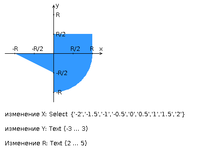

Лабораторная работа #1
Вариант 3211

[пример](https://itmoweblab1aaaaaa.herokuapp.com/)

Разработать PHP-скрипт, определяющий попадание точки на координатной плоскости в заданную область, и создать HTML-страницу, которая формирует данные для отправки их на обработку этому скрипту.

Параметр R и координаты точки должны передаваться скрипту посредством HTTP-запроса. Скрипт должен выполнять валидацию данных и возвращать HTML-страницу с таблицей, содержащей полученные параметры и результат вычислений - факт попадания или непопадания точки в область. Предыдущие результаты должны сохраняться между запросами и отображаться в таблице.

Кроме того, ответ должен содержать данные о текущем времени и времени работы скрипта.

### Разработанная HTML-страница должна удовлетворять следующим требованиям:
- [X] Для расположения текстовых и графических элементов необходимо использовать табличную верстку.
- [X] Данные формы должны передаваться на обработку посредством GET-запроса.
- [X] Таблицы стилей должны располагаться в самом веб-документе.
- [X] При работе с CSS должно быть продемонстрировано использование селекторов атрибутов, селекторов дочерних элементов, селекторов элементов, селекторов псевдоклассов а также такие свойства стилей CSS, как наследование и каскадирование.
- [X] HTML-страница должна иметь "шапку", содержащую ФИО студента, номер группы и новер варианта. При оформлении шапки необходимо явным образом задать шрифт (serif), его цвет и размер в каскадной таблице стилей.
- [X] Отступы элементов ввода должны задаваться в процентах.
- [X] Страница должна содержать сценарий на языке JavaScript, осуществляющий валидацию значений, вводимых пользователем в поля формы. Любые некорректные значения (например, буквы в координатах точки или отрицательный радиус) должны блокироваться.

### Вопросы к защите лабораторной работы:

- [X] Протокол HTTP. Структура запросов и ответов, методы запросов, коды ответов сервера, заголовки запросов и ответов.
- [X] Язык разметки HTML. Особенности, основные теги и атрибуты тегов.
- [X] Структура HTML-страницы. Объектная модель документа (DOM).
- [X] HTML-формы. Задание метода HTTP-запроса. Правила размещения форм на страницах, виды полей ввода.
- [x] Каскадные таблицы стилей (CSS). Структура - правила, селекторы. Виды селекторов, особенности их применения. Приоритеты правил. Преимущества CSS перед непосредственным заданием стилей через атрибуты тегов.
- [X] LESS, Sass, SCSS. Ключевые особенности, сравнительные характеристики. Совместимость с браузерами, трансляция в "обычный" CSS.
- [X] Клиентские сценарии. Особенности, сферы применения. Язык JavaScript.
- [x] Версии ECMAScript, новые возможности ES6 и ES7.
- [X] Синхронная и асинхронная обработка HTTP-запросов. AJAX.
- [X] Библиотека jQuery. Назначение, основные API. Использование для реализации AJAX и работы с DOM.
- [X] Реализация AJAX с помощью SuperAgent.
- [X] Серверные сценарии. CGI - определение, назначение, ключевые особенности.
- [X] FastCGI - особенности технологии, преимущества и недостатки относительно CGI.
- [X] Язык PHP - синтаксис, типы данных, встраивание в веб-страницы, правила обработки HTTP-запросов. Особенности реализации принципов ООП в PHP.

